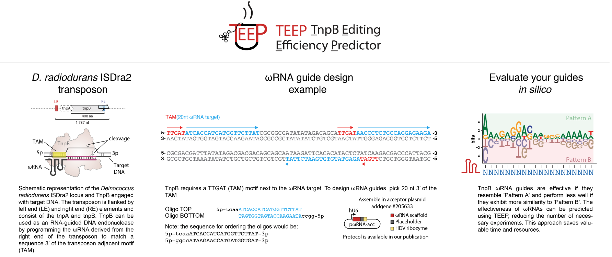

# TnpB Model Setup and Usage Guide
<p align="center">
  
</p>


## Overview
This guide details the steps necessary for setting up the environment, training, and using the TnpB model for both training and inference.

## Environment Setup

### Creating a Virtual Environment
We recommend using Conda to manage your Python environments. Follow these steps to set up a dedicated environment for this project:

1. **Create the Environment**:
   ```bash
   conda create --name Tnpb 
   conda activate Tnpb
   conda install -c anaconda python=3.6
   pip install -r requirements.txt


## Model Training
To train the TnpB model, follow these steps:
1. **Data Preparation**
   - Run `data_preprocess.ipynb` to process the data and save it in the `/data/processed` directory.
2. **Model Training and Evaluation**
   - Execute `models_trainvaltest.ipynb` or `models_trainvaltest.py` to train and evaluate the models.
   - Supported models include: `FFN`, `RNN`, `CNN`, `Transformer`.
   - Trained models are saved in the `/output` directory.
3. **Inference**
   - Use `models_inference.ipynb` or `models_inference.py` for running inference with trained models.
4. **Sample Testing**
   - Execute `user_sample_inference.ipynb` to test the model on your data. Example test file: `data/Endogenous_spacers_TnpB_list.csv`.
   - Predictions are saved in the `/output` directory.

## Model Inference
For running model inference:
1. **Setup**
   - Ensure the environment is set up using `requirements.txt`.
   - Place your Excel data file containing target sequences at `./data/Endogenous_spacers_TnpB_list.csv`.
2. **Model Download**
   - Download the trained model from [this Dropbox link](https://www.dropbox.com/scl/fo/w2o66tafvt8upzcduwo52/ACNeSe1lCbruhiATdzeHKEI?rlkey=0l34lfkmguy88wvwjt18qxbco&st=also9pij&dl=0) and add it to the `/output` directory.
3. **Run Inference**
   - Run `user_sample_inference.ipynb` to test your sample data. Predicted outputs are stored in the `/output` directory.
   - You can also directly run  `python user_sample_inference.py -data_name 'Endogenous_spacers_TnpB_list.csv'`

## Web Interface
- Access our web-based interface at [tnpb.app](https://www.tnpb.app/) to use the model directly without installing or running any Python code.
